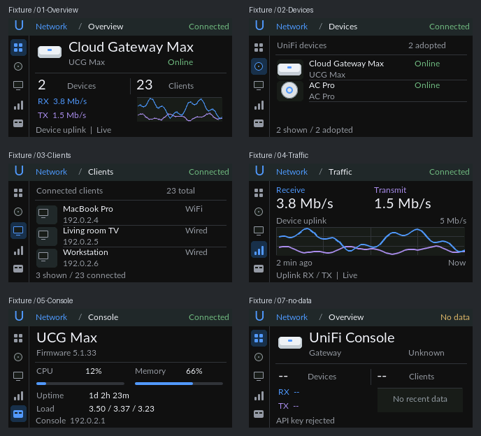

# T-Display-S3 — UniFi Network Console

针对 320×170 屏幕重新构建的 UniFi 控制台。参考实际 Network 10.6.101 深色界面：左侧功能栏、Network 应用标题、设备图形与摘要、紧凑设备/客户端列表、独立流量活动视图及系统资源条。界面围绕五个视图组织，流量曲线按实际时间平滑滚动。



预览直接编译 `src/unifi_view.c` 并使用真实 LVGL 渲染；图中为匿名测试数据，未冒充实机照片。字体采用 UniFi 官方网页字体栈中的开源后备 Lato。小屏上的尺寸、间距、图形是适配设计，不是官方设计令牌的逐像素复刻。

## 五个视图

| 功能 | 内容 |
|---|---|
| Overview | 控制台名称/型号/状态、设备与客户端总数、上联 RX/TX、最近活动 |
| Devices | 最多三台已纳管设备，设备图形、名称、型号、在线状态 |
| Clients | 最多三个连接客户端，名称、IP、连接类型与全站总数；不是流量排行 |
| Traffic | 上联收发速率和最近两分钟活动图，时间坐标使用真实采样时间 |
| Console | 型号、固件、CPU/内存资源条、运行时间、1/5/15 分钟负载、地址 |

GPIO0 上一页、GPIO14 下一页切换侧栏功能；30ms 消抖，按下响应，60 秒无操作回 Overview。页面瞬时切换，保持完整画面与共享采样历史，不播放装饰动画。

## 数据与显示

- 仅使用官方 UniFi Network 本地 Integration API 的 GET 请求，不再使用 iKuai token、会话或字段。
- 速率为选定设备的 `uplink.rxRateBps/txRateBps`，显示十进制 kbps、Mbps、Gbps，与 UniFi 网络速率语义一致。内部采集缓存仍保存 B/s。
- 上联活动不宣称是 WAN 吞吐；控制台 API 连接成功不证明互联网连通。网关延迟是显示板实际 DHCP 网关的 ICMP 结果。
- 官方接口未返回的温度、会话协议计数、WAN 实时健康、客户端流量排名不再占用界面。
- 缺失数据为 `--`，有效零值为 `0`。列表过期显示不可用；没有虚构设备行。
- 图表依据采样时间定位；超过 10 秒的采样间隔断开连线，过期数据清空图表。纵轴按当前数据范围标记，横轴固定最近 120 秒。没有沿用原来的固定 FPS 曲线或假定每次请求等间隔。
- 保留 Wi-Fi 重试、夜间背光、首帧完成后亮屏和 UI 工作栈放置于 PSRAM 的机制。

主统计请求按 1 秒周期调度，请求变慢时不并发堆积；每 5 秒轮转一个扩展请求，设备/客户端/WAN 各源至少约 15 秒一次。主请求失败退避 4/8/16/32 秒；429 遵守数字 `Retry-After`（最多 300 秒，无有效值则 30 秒）。socket 超时 5 秒不等于整个事务的硬截止时间。

主数据过期门限为 10 秒、扩展 30 秒、心跳 90 秒。成功 HTTP 中的陈旧心跳也会被拒绝。JSON 使用 SDK 的 cJSON，解析分配在 PSRAM，设备分页完整成功才发布计数。

## UniFi API 配置

参考 [官方 API 指南](https://help.ui.com/hc/en-us/articles/30076656117655-Getting-Started-with-the-Official-UniFi-API) 与控制台 `Integrations → Network API` 中对应版本的文档。本项目针对 UniFi OS 的本地 Network Integration API；其他部署方式的 URL 前缀可能不同。完整首次配置见[仓库 README](../../README.md)。

1. 保留 `src/config.h` 中的 Wi-Fi 配置，将 `unifi_config.example.h` 复制为 `unifi_config.h`。
2. `UNIFI_HOST` 填局域网 HTTPS origin，例如 `https://console.example.test`，不能填 Site Manager 仪表盘 URL。
3. 在 Network 的 Integrations 创建专用 API Key，填入 `UNIFI_API_KEY`。固件只读，但密钥权限由 UniFi 账号决定，不能声称该密钥本身只读。
4. `UNIFI_SITE_ID`、`UNIFI_DEVICE_ID` 留空时，只允许自动选择唯一站点和唯一 gateway；多站点/多网关需明确填写 Integration UUID。实际 10.6.101 的 UCG Max 只返回 `switching` 特征，没有 `gateway`；这种情况必须根据已核实的设备清单填写 `UNIFI_DEVICE_ID`，不能把任意交换机当网关。云控制台 ID 和 `default` 不是这些 UUID。
5. TLS 保持证书与名称验证。使用私有/自签证书时，按 `unifi_cert.example.h` 创建本地信任证书文件；IP 不在证书 SAN 中时设置 `UNIFI_TLS_SERVER_NAME` 为证书内的 DNS 名。证书更换后需重新核对并构建，不能通过关闭验证解决。

端点统一以 `/proxy/network/integration/v1` 为前缀：

| GET 路径 | 用途 |
|---|---|
| `/sites` | 发现站点 |
| `/sites/{siteId}/devices` | 分页设备清单，最多 1000 项，完整成功才发布 AP 计数 |
| `/sites/{siteId}/devices/{deviceId}/statistics/latest` | CPU、内存、负载、运行时间、上联速率与心跳 |
| `/sites/{siteId}/clients?offset=0&limit=3` | 首三项和 `totalCount` |
| `/sites/{siteId}/wans?offset=0&limit=2` | 首两条配置名称 |

不再使用 iKuai token、账号登录、浏览器 Cookie 或 iKuai JSON 字段。旧的本地配置文件保留，但不再读取其中的 `IKUAI_*` 字段。

## 构建与验证

历史构建路径仍是 `examples/ikuai_widget`。

```bash
# 在 examples/ikuai_widget 中，首次创建本地配置（不要覆盖已有文件）
test -f src/config.h || cp src/config.example.h src/config.h
test -f src/unifi_config.h || cp src/unifi_config.example.h src/unifi_config.h
# 填入 Wi-Fi、UniFi API Key、站点/设备 ID；私有证书配置见上文
pio run -e t-display-s3
```

```bash
# 在仓库根目录执行
python3 tests/test_system_health_parser.py
python3 tests/test_telemetry_timing.py
python3 tests/test_http_recovery.py
python3 tests/render_unifi_ui.py
```

主机测试使用实际 C 解析器和 LVGL 视图，覆盖心跳、字段边界、分页、ICMP、重试/限流、五视图导航、布局范围、零值与过期状态、图表时间坐标及断采。解析测试可额外传入包含 `sites.json`、`devices.json`、`stats0.json`、`clients.json`、`wans.json` 的本地目录进行实时响应验证；统计心跳必须仍在有效期内。测试不会主动读取或打印密钥。

渲染原始 PPM 位于 `/tmp/unifi-console-render`。固件环境强制 `APP_DEMO_MODE=0`，没有配置也不会产生演示数据。构建和主机测试不替代屏幕颜色、亮度和实体按键的实机确认。

2026-09-12 修复：按官方 T-Display-S3 配置使用 RGB 通道顺序，保留 RGB565 传输字节交换和屏幕反色。界面每 100 ms 检查数据，当前可见曲线每 50 ms 按真实时间移动；这不是 API 的采样频率，也不插值伪造新数据。启动日志记录复位原因，每 30 秒记录运行时间和 API 有效状态，便于区分重启与背光异常。

`config.h`、`unifi_config.h`、`unifi_cert.h`、构建产物均被 Git 忽略。密钥为本地固件专用，创建时间与有效期以控制台 Integrations 页面为准。

## 硬件

- **主控**：ESP32-S3R8（Wi-Fi / BLE，16MB Flash，8MB OPI PSRAM）
- **屏幕**：ST7789，170×320，**8-bit 并口（i80，非 SPI）**
- **按键**：BOOT（GPIO0）固定上一页；IO14（GPIO14）固定下一页

## ⚠ 重点注意事项（移植/烧录前必读）

1. **GPIO15 是外设总电源**：必须在初始化最前面置高，否则 LCD、背光全部不工作。已在 `lcd_init()` 首步处理，改动启动流程时不要删掉。
2. **屏幕是并口不是 SPI**：D0-D7 = GPIO 39/40/41/42/45/46/47/48，WR=8、DC=7、CS=6、RST=5、BL=38。驱动基于 `esp_lcd` i80，与 SPI 驱动不通用。
3. **sdkconfig 必须匹配**：Flash 16MB QIO 80MHz、PSRAM **OPI** 80MHz。已提供 `sdkconfig.defaults`，首次构建会自动生效；若用旧 sdkconfig 构建请先删除再重建。
4. **使用 ESP-IDF 构建环境**：不要套用 Arduino USB CDC 宏；外部供电黑屏时先核对供电、复位日志和夜间背光。
5. **烧录失败时手动进下载模式**：按住 BOOT → 按一下 RST → 松开 RST → 松开 BOOT，然后重新 upload。
6. **分辨率**：屏幕按横屏 320×170 适配（底部信息行紧贴下边缘，改布局时注意）。
7. **状态不依赖额外外设**：本固件只使用屏幕和板载 BOOT/IO14 按键；在线状态由屏幕状态点与文案显示。

## 代码结构

- `desktop_widget.c`：Wi-Fi、授时、背光、按键和 UI 任务生命周期。
- `unifi_view.c/h`：新的五视图 UI；主机预览直接编译同一份代码。
- `unifi_monitor.c/h`：官方 Integration API、ICMP 与有效性判断。
- `lcd_driver.c/h`、`lv_port_disp.c/h`：ST7789 i80 与 LVGL 显示移植。
- `fonts/`：Lato 12/20px 字体及许可证。

Traffic 采样说明：统计请求每 1 秒发起一次（请求变慢时不并发堆积），库存查询结束后及时恢复。控制台统计更新周期可能慢于轮询周期，重复请求不能保证获得每秒的新速率；50 ms 曲线动画不代表数据采样频率。

2026-09-12 曲线修复：流量历史扩展为 128 点，覆盖 1 Hz 轮询下的完整 120 秒窗口；Ping 仍独立保留 60 点。纵轴仅按可见时间窗口计算峰值，留出余量；缩小时使用滞回与渐变，避免峰值离开窗口时整条曲线突然跳动。启动后需积累两分钟真实采样才能填满图框，真实断采仍保留空缺。

## 2026-09-16：连接恢复与长时间运行

HTTP 设置/传输失败以及不完整响应会销毁旧客户端，下次重试重新建立 TLS 连接并发送 GET。响应头超时的 `ESP_ERR_HTTP_EAGAIN` 归类为超时，避免保留旧请求状态。网络切换也在采集任务中清理客户端；正常成功连接继续复用，认证与 429 冷却语义保留。

UI 计时统一采用 64 位毫秒，图表与按键计时跨越约 49.7 天边界保持连续。旧 Ping 会话先解除身份再异步停止，迟到回调不会污染新网络历史。

HTTP 恢复回归测试使用实际 `api_get` 和事件处理代码配合模拟传输状态，不连接真实控制台。测试通过、固件烧录校验以及启动后持续采集已经确认；实际断网恢复和本轮相机验收仍未完成。完整接口表、时效规则、首次配置和验收步骤以[主 README](../../README.md)为准。
